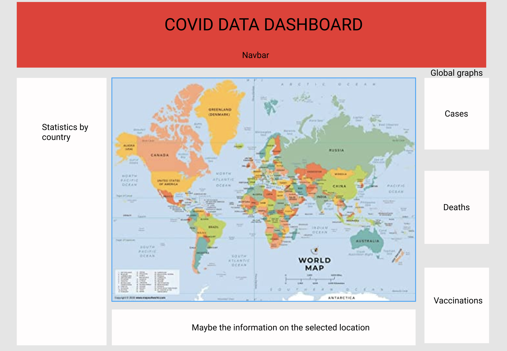

# Covid dashboard app

This is a Covid dashboard project to upskill in react as suggested by this website:
https://www.freecodecamp.org/news/8-reactjs-project-ideas-to-start-learning-by-doing/

This project uses the [Open disease data api](https://disease.sh/) to fetch and display global covid data.

[Leaflet](https://leafletjs.com/index.html) is used to display the map data.

This application was originally deployed †o https://covid-datatracker-dashboard.herokuapp.com/ but is now no longer available.

---

## Contents

1. [Current state of app](#Current-state-on-main)
2. [Project plan](#Project-plan)
3. [Getting started](#Getting-started)
4. [Repo structure](#Repo-structure)
5. [Running the application](#Running-the-application)
6. [Deploying the application](#Deploying-the-application)
7. [Notes](#Notes)
8. [Contributors](#Contributors)

---

## Current state on main

Currently this application allows users to see:

- The total global number of cases/deaths/cases today and deaths today at the head of the statistics board
- A statistics board with key info on each country/continent depending on what state the application is in
- A map with markers sized by case numbers for each country/continent
- The ability to switch between country/continent and vaccination data via the navbar
- Graphs following the total global number of cases/deaths/vaccinations since 2019

---

## Current state on Dev

Currently this application allows users to see:

- Interactive chloropleth map of continents with number of cases per Million
- Interactive chloropleth map of countires with number of cases per million
- Total number of global cases, deaths, cases today and deaths today displayed on Statistics board
- Key info on each countries' total number of cases and deaths displayed on the statistics board
- Key info on each Continent's total number of cases and deaths displayed on the statitsics board
- Graphs displaying global cases/deaths since 2019

---

## Project plan

Here is the basic figma design of the application in it's end-state:



The basic layout will be:

- A chloropleth map
- A statistics board detailing the key statistics for each country
- A header/navbar for the Covid dashboard
- Graphs of global data for cases/deaths/vaccinations
- A modal detailing key statistics for a country when clicked on

## Future plans

- Convert project from javascript and jsx to typescript
- Convert from a SPA to a multipage application
- Include greater amounts of information on each country/continent
- Find another api for vaccinations as the current one is broken
- Add a CI/CD pipeline with heroku deployment

---

## Getting started

To install this app on your local machine run:

```
git clone git@github.com:RTurney/Covid-dashboard.git
```

Once installed, you will need to install the necessary dependencies by running:

```
cd Covid-dashboard
yarn install
```

Once the installation is finished, you are good to go!
Go to [running the application](#running-the-application) to learn more about using the application.

---

## Repo structure

- node_modules/
- public/
- src/
  - tests/
  - api/
  - assets/
  - components/
    - GraphComponents/
    - MapComponents/
    - StatsComponents/
    - utils/
    - contexts/
    - data/
    - styles/
- .gitignore
- package.json
- README.md
- yarn.lock

### node_modules/

This is where all node modules are installed and stored.

### public/

A public folder for containing public files such as the favicon icon.

### src/

- tests/
  > Contains unit tests for each component or util employed in the application.
- api/
  > contains all the api fetch functions for this application
- assets/
  > contains png/jpeg assets used within this application
- components/
  - GraphComponents/
    > Contains CaseGraph.js / DeathGraph.js / GraphBoard.js & VaccinesGraph.js components. GraphBoard.js is the main component holding CaseGraph, DeathGraph and VaccinesGraph. All 3 graph components display current totals from the last 10 days and are displayed using react-vis.
  - MapComponents/
    > Contains all components necessary for the Map. These components work using the react-leaflet module to display polygonal geoJson data for each country and continent. Colour each country/continent is based on case data for that country/continent
  - StatsComponents/
    > Contains all components for the Stats board. The StatisticsBoard.js is the main component rendered in App.js and holds the StatsTotals, ContinentStats & CountryStats
  - utils/
    > Contains utility functions required throughout the application
  - contexts/
    > Contains contexts and providers for this application such as DataContext
  - data/
    > Holds geoJSON and other data files
  - styles/
    > Contains all the css style files for each component
- TickerDisplay.js
  > Contains the ticker display component
- NavBar.js
  > Contains the Navbar component with buttons to switch between Country, continent or vaccine data.
- App.js
  > Contains the main code for running this application.
  > Also runs all the fetch functions for the api data and the loading state

---

## Running the application

To run this application locally run this command in your terminal:

```
yarn start
```

This should start the application server and this app will load within your default browser at [localhost:3000](http://localhost:3000)

You should now be able to access this application. The server automatically refreshes when any changes are saved to file.

To run the tests for this application run:

```
yarn test
```

To run the linter for this application:

```
yarn lint
```

Husky is used for pre-commit hooks, running both the linter and tests before each commit.

---

## Deploying the application

This application is no longer deployed to Heroku at:
https://covid-datatracker-dashboard.herokuapp.com/

Deployment will only be made from the main branch.
No pipeline has been set up yet.

---

### Notes

This project is currently still in development

Branch structure:
Main branch will be used as the main deployment branch.
Dev will be used for creating new branches to add or further develop features

---

### Contributors

Any contributors to this application should add their name and contact details to this list below:

- Richard Turney
  - richard.turney@and.digital
